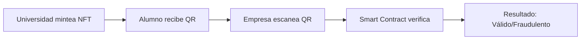

# 🎓 AcademicChain Ledger - Sistema Global de Credenciales Académicas

**AcademicChain Ledger** en Hedera Hashgraph

## 📋 Descripción

AcademicChain Ledger es un sistema global de verificación académica **antifraude** que tokeniza títulos como NFTs dinámicos (HIP-746) en la red de Hedera Hashgraph.

### 🎯 Propósito
- **Eliminar el fraude educativo** ($20 mil millones anuales en pérdidas)
- **Automatizar verificaciones** de credenciales académicas
- **Integrar con plataformas** como LinkedIn, Indeed
- **Proporcionar verificación instantánea** vía QR + Wallet

## 🏗️ Arquitectura del Sistema

```
┌─────────────────┐    ┌─────────────────┐    ┌─────────────────┐
│   Frontend      │    │   Backend       │    │   Hedera        │
│   (Next.js)     │◄──►│   (Node.js)     │◄──►│   (HTS + SC)    │
│                 │    │                 │    │                 │
│ • Portal Univ.  │    │ • API REST      │    │ • NFTs (HIP-746)│
│ • QR Generator  │    │ • Hedera SDK    │    │ • Smart Cont.   │
│ • Verification  │    │ • Auth System   │    │ • Consensus     │
└─────────────────┘    └─────────────────┘    └─────────────────┘
```

## 🚀 Características Principales

### ✅ Fase 1 - MVP (Mes 1-3)
- [x] Tokenización de títulos como NFTs dinámicos
- [x] Portal web para universidades
- [x] Verificación vía QR + Wallet
- [x] Smart Contract de verificación

### 🔄 Fase 2 - Escalamiento (Mes 4-6)
- [ ] Integración con LinkedIn, Indeed
- [ ] Alianzas con gobiernos
- [ ] Tokenomics con HBAR

### 🌍 Fase 3 - Dominio Global (Mes 7+)
- [ ] Standard global de verificación
- [ ] Integración con IA predictiva

## 🛠️ Tecnologías

| Componente | Tecnología |
|------------|------------|
| **Tokens (NFTs)** | HTS + HIP-746 |
| **Smart Contracts** | Hedera Smart Contract 2.0 (Solidity) |
| **Frontend** | Next.js + HashPack Wallet |
| **Backend** | Node.js + Hedera JS SDK |
| **Base de Datos** | Hedera Consensus Service |

## 📦 Instalación

### Prerrequisitos
- Node.js 18+
- Cuenta de prueba en [Hedera Portal](https://portal.hedera.com/)
- HashPack Wallet

### Instalación Rápida

```bash
# Clonar el repositorio
git clone https://github.com/tu-usuario/academicchain-ledger.git
cd academicchain-ledger

# Instalar dependencias
npm install

# Configurar variables de entorno
cp .env.example .env
# Editar .env con tus credenciales de Hedera

# Ejecutar en desarrollo
npm run dev
```

## 🔧 Configuración

### Variables de Entorno (.env)

```env
# Hedera Configuration
HEDERA_NETWORK=testnet
HEDERA_ACCOUNT_ID=0.0.123456
HEDERA_PRIVATE_KEY=302e020100300506032b657004220420...

# Server Configuration
PORT=3001
JWT_SECRET=your-jwt-secret

# Database (opcional)
DATABASE_URL=your-database-url
```

## 📱 Uso

### Para Universidades
1. **Registro**: Crear cuenta en el portal
2. **Mintear NFT**: Emitir título como NFT
3. **Generar QR**: Crear código QR para el graduado
4. **Actualizar**: Modificar metadata cuando sea necesario

### Para Empresas
1. **Escanear QR**: Usar la app móvil
2. **Verificar**: Consultar validez en Hedera
3. **Resultado**: Recibir confirmación instantánea

### Para Graduados
1. **Recibir NFT**: Título tokenizado en wallet
2. **Compartir QR**: Mostrar a empleadores
3. **Actualizar**: Agregar nuevas certificaciones

## 🔍 Ejemplo de Flujo



## 💰 Modelo de Negocio

- **Universidades**: Tarifa anual en HBAR
- **Empresas**: Pago por verificación ($0.0001 USD)
- **Gobiernos**: Licencias para verificación masiva

## 🧪 Testing

```bash
# Ejecutar tests
npm test

# Tests específicos
npm test -- --testNamePattern="NFT"
npm test -- --testNamePattern="Verification"
```

## 📊 Métricas

- **Velocidad**: 10,000 TPS (Hedera)
- **Costo**: $0.0001 USD por verificación
- **Tiempo**: < 3 segundos por consulta
- **Seguridad**: Consenso asíncrono bizantino

## 🤝 Contribuir

1. Fork el proyecto
2. Crear rama feature (`git checkout -b feature/AmazingFeature`)
3. Commit cambios (`git commit -m 'Add AmazingFeature'`)
4. Push a la rama (`git push origin feature/AmazingFeature`)
5. Abrir Pull Request

## 📄 Licencia

Este proyecto está bajo la Licencia MIT - ver el archivo [LICENSE](LICENSE) para detalles.

## 🆘 Soporte

- **Documentación**: [docs.academicchain-ledger.com](https://docs.academicchain-ledger.com)
- **Discord**: [discord.gg/academicchain-ledger](https://discord.gg/academicchain-ledger)
- **Email**: support@academicchain-ledger.com

## 🙏 Agradecimientos

- **Hedera Hashgraph** por la infraestructura
- **UT Austin** por las pruebas piloto
- **Comunidad blockchain** por el apoyo

---

**🚀 ¿Listo para revolucionar la verificación académica? ¡Empecemos!** 